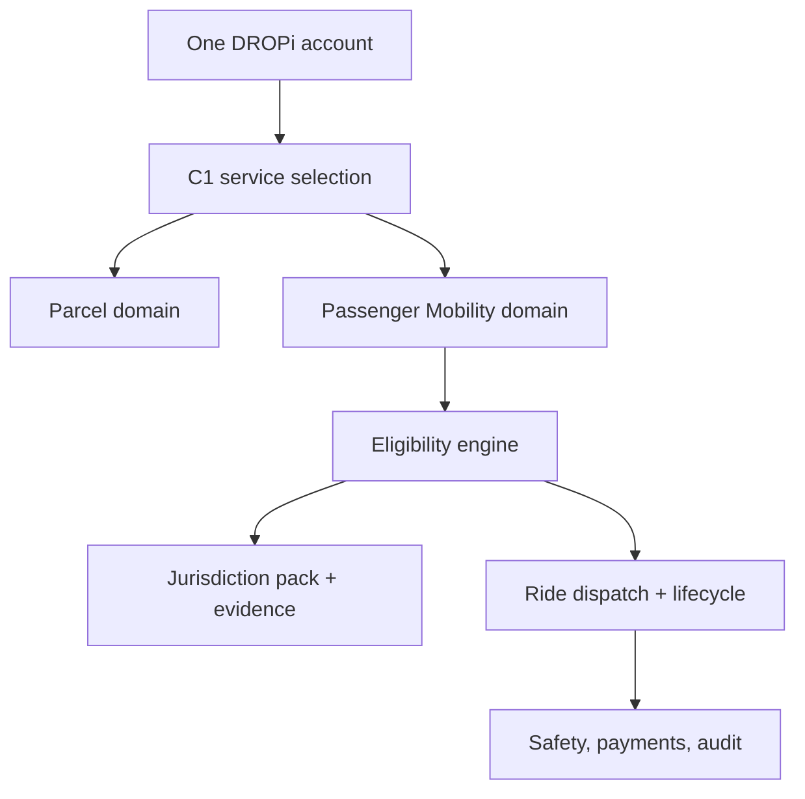

# C1 Passenger Mobility — Technical Implementation Plan

**Version:** 1.0.0
**Status:** PLANNING — NOT IMPLEMENTED
**Date:** 2026-09-12
**Canonical source:** `canonical/PASSENGER_MOBILITY.md`
**UX source:** `docs/ux/PASSENGER_MOBILITY_UX_SPEC.md`

## 1. Outcome and boundary

This plan adds a dedicated passenger-ride domain to C1 while preserving the same DROPi identity and role system. It does not create a new channel, turn deliveries into rides, or enable production service.

Initial planned jurisdiction packs:

- Romania — alternative passenger transport by eligible car;
- Philippines — LTFRB TNC/TNVS car service;
- Philippines Zone 0 — motorized tricycle, configuration only and hard-disabled until the exact LGU confirms the model.

C2 Passenger Mobility is reserved for a later decision. C3 Passenger Mobility is prohibited because emergency/patient transport is a different regulated service.

## 2. Current-state findings

The repository already provides reusable primitives:

- authenticated accounts, sessions, C1 roles, and Admin roles;
- tRPC routers and server-side authorization middleware;
- secure verification-evidence attachment handling;
- audit logs, operational traces, incident reconstruction, privacy ledgers, and authority reports;
- notification, payment-provider, map/location, marketplace, and delivery foundations;
- delivery-partner profiles and selection/rating code.

It does not yet provide a passenger domain. The current model has important boundaries:

| Current element | Finding | Passenger Mobility action |
|---|---|---|
| `users.dropiRole` | One canonical role | Keep it; do not add `taxi_driver` as a mutually exclusive role |
| `users.channel` | One C1/C2/C3/Admin context | Keep Passenger Mobility inside C1 |
| `users.isVerified` | Global boolean | Never use as passenger authority; deprecate for operational authorization |
| `verifications` | User-bound, limited document enum | Preserve for delivery compatibility; migrate/copy reviewed evidence into normalized subject-bound records only through an explicit mapping |
| `user-verification-policy.ts` | An approved current driving or drone licence can satisfy delivery-partner operational verification | Do not call it for ride eligibility; a driving licence alone is insufficient |
| `orders` / `deliveries` | Cargo lifecycle and parcel fields | Do not extend into a passenger system of record |
| `pilotProfiles` | Delivery-centric availability, weight, vehicles, zones, and ratings | Split shared presence from service-specific metrics and capabilities |
| `auditLogs` | General audit primitive | Reuse with passenger resource types; keep high-risk evidence in restricted stores |

No current record may be grandfathered into `passenger_car` or `passenger_tricycle` solely because `isVerified = true` or because a driving licence is approved.

## 3. Target architecture



The same human account may act as passenger, merchant, and Delivery Partner. Passenger booking is a C1 service participation context rather than a mutually exclusive role change. Operational permission to provide rides is resolved by a service-capability decision at the time of each sensitive action. AI-agent and phantom sessions are denied real passenger booking and ride-execution mutations.

### 3.1 Bounded contexts

| Context | Responsibility | Must not own |
|---|---|---|
| Identity/RBAC | Human account, session, platform/Admin permissions | Transport authority |
| Compliance | Entities, evidence, requirements, reviews, contracts | Ride matching |
| Capability | Computed person/operator/vehicle/service/zone permission | Document binary storage |
| Passenger Ride | Quote, request, offers, match, trip state | Parcel order state |
| Dispatch/Presence | Online mode, selected vehicle, location freshness, offer arbitration | Legal evidence decisions |
| Safety | Incident intake, restrictions, preservation, escalation | Public ratings |
| Money | Price version, authorization/capture, receipt, refund, payout | Eligibility truth |
| Audit/Reporting | Immutable decisions/events/access/export | Mutable business state |

## 4. Data model

Use a new migration generated through the repository’s Drizzle workflow, including SQL, journal entry, and snapshot. Names below are planning names; an Architecture/DB review may refine them without changing the semantic boundaries.

### 4.1 Compliance and authority

| Aggregate/table | Essential fields and constraints |
|---|---|
| `jurisdictions` | ISO country, subdivision/locality/LGU, timezone, currency, status |
| `operatingZones` | jurisdiction, polygon/route rules, service hours, status, version |
| `jurisdictionPacks` | service, vehicle class, version, state, source/effective/review dates, approved-by pair, content hash |
| `capabilityRequirements` | pack, subject type, evidence/contract type, mandatory rule, validity/reverification, conditional expression |
| `legalEntities` | entity type, jurisdiction, identifiers, registered address, status; sensitive fields separately protected |
| `entityRelationships` | platform/Zone Operator/transport operator/driver relationship, scope and effective period |
| `transportOperators` | legal entity or sole-person reference, regulator authorization status, tax/operating metadata |
| `mobilityVehicles` | operator, stable vehicle ID, plate/official identifier, class, make/model/year, registered seats, status |
| `complianceDocuments` | subject type/ID, type, issuer, number token/digest, issue/effective/expiry, storage object, integrity hash, privacy class |
| `documentReviews` | document/version, decision, reviewer, rationale code/text, verification method, policy version, timestamp; append-only |
| `agreements` | agreement type/version/jurisdiction/content hash/effective period |
| `agreementAcceptances` | agreement, party/authority-to-sign, capability scope, timestamp, signature evidence |
| `partnerCapabilities` | user, service, vehicle, operator, pack, zone, state, effective/expiry, decision snapshot/hash, suspension reason |
| `capabilityDecisionEvents` | prior/new state, trigger, actor, policy/evidence versions, evaluated facts digest; append-only |
| `reverificationRuns` | pack/capability scope, due/start/finish, result and affected capabilities |

Constraints:

- unique active capability per `(user, service, vehicle, operator, zone, pack-version scope)`;
- a document belongs to an explicit subject; it is not implicitly reusable across people, vehicles, or operators;
- document binary access is separate from metadata access;
- pack activation and high-risk override require two distinct authorized humans;
- all effective-period comparisons use server time and jurisdiction timezone only for display/business calendars.

### 4.2 Ride, dispatch, safety, and money

| Aggregate/table | Essential fields and constraints |
|---|---|
| `rideQuotes` | requester, zone, pickup/destination snapshots, class, passenger count, price components, pricing version, expiry, terms versions |
| `rides` | UUID, requester/passenger, quote, zone, class, passenger count, state/version, matched driver/vehicle/operator, payment state, timestamps |
| `rideStops` | ordered pickup/destination records, normalized address, encrypted/controlled precise coordinates |
| `rideOffers` | ride, candidate, vehicle, offered/expiry/response, earnings disclosure, decision; one winning offer |
| `rideEvents` | ride, sequence, event type, source, actor, client/server time, idempotency key, payload, integrity link; append-only |
| `partnerPresence` | partner, service mode, vehicle, zone, current/stale status, coarse operational fields |
| `partnerLocations` | ride/presence scope, point/time/accuracy/source, retention class; partition/TTL strategy |
| `rideSafetyIncidents` | ride/party, category/severity/state, restricted narrative, preservation/hold, escalation owner |
| `ridePayments` | quote/ride/provider refs, authorization/capture/refund status, currency/amount |
| `rideReceipts` | ride, legal issuer/operator, immutable line items, tax/fiscal refs, rendered object, issued time |
| `ridePayouts` | ride, operator/driver beneficiary, commission, adjustments, payout state/reference |
| `rideRatings` | ride/rater/subject, score, structured tags; separate from safety records |

Required database safeguards:

- optimistic version on `rides` and capability/config records;
- unique `(rideId, sequence)` and `(actor, idempotencyKey, action-scope)`;
- at most one accepted/winning offer per ride;
- transactionally enforced active-mission lock per partner and vehicle across delivery and passenger domains;
- immutable event/review records; corrections are compensating events;
- no unrestricted cascade deletion of rides, decisions, agreements, incidents, payments, or audit records;
- legal hold blocks scheduled deletion for the held subject/scope.

## 5. Eligibility service

Implement one pure, explainable evaluator and one transaction-bound enforcement layer.

### 5.1 Inputs

- authenticated human and account state;
- requested action: apply, go online, receive offer, accept, arrive, board, start, continue;
- service and vehicle class;
- selected vehicle and transport operator;
- jurisdiction/zone and pack version;
- effective documents and latest final reviews;
- current agreements/entity relationships;
- platform/pack/zone/operator/service kill switches;
- active mission, safety suspension, and location/presence state.

### 5.2 Output

Return a signed/stable decision envelope:

```ts
type CapabilityDecision = {
  allowed: boolean;
  capabilityId?: string;
  evaluatedAt: string;
  policyVersion: string;
  evidenceVersionHash: string;
  publicReasonCodes: string[];
  restrictedReasonCodes: string[];
  validUntil?: string;
};
```

The mobile client receives only public reason codes. Restricted details remain in compliance/audit access. `allowed` must be recomputed server-side for offer, accept, and trip start; a cached client status is informational.

### 5.3 Migration from `isVerified`

1. Document every current use of `users.isVerified` and classify it as identity, delivery, passenger, or mistaken/global.
2. Keep the column temporarily for backward compatibility.
3. Introduce `parcel_ground`/`parcel_drone` capabilities using explicit delivery-policy migration rules.
4. Do not generate any passenger capability during migration.
5. Move delivery authorization checks to the capability service behind a compatibility adapter.
6. Convert reads, then writes, then tests; measure mismatches in shadow mode.
7. Retire operational reliance on `isVerified` only after rollback and reconciliation reports pass.

## 6. API and service surface

Add dedicated tRPC namespaces; do not overload marketplace `orders` or delivery routers.

### 6.1 Customer `mobility`

- `availability.query`
- `quote.create`
- `quote.get`
- `ride.request`
- `ride.get`
- `ride.cancel`
- `ride.confirmPickup`
- `ride.shareToken.create/revoke`
- `ride.receipt`
- `ride.rate`
- `ride.reportLostItem`
- `ride.reportIssue`

### 6.2 Partner `mobilityPartner`

- `capabilities.list`
- `application.get/save/submit`
- `evidence.requirements/uploadSession/submit`
- `vehicles.list/register/update`
- `presence.setMode`
- `presence.heartbeat`
- `offers.list/respond`
- `ride.arrive`
- `ride.confirmPassengerOnBoard`
- `ride.start`
- `ride.complete`
- `ride.cancelOrSafetyStop`

### 6.3 Admin `mobilityAdmin`

- jurisdiction pack create/version/submit/approve/enable/suspend;
- entity/operator/vehicle relationship management;
- review queue, document decision, second approval, reverification;
- capability inspect/suspend/revoke/restore with governed reason;
- live operational view and scoped intervention;
- safety incident triage, preservation, escalation, closure;
- pricing/receipt configuration;
- regulator/auditor export;
- kill-switch activation/deactivation.

Every mutation requires schema validation, RBAC plus subject/zone scope, server-side state authorization, idempotency where retried, audit middleware, and a redacted error contract.

## 7. Ride state machine and concurrency

Canonical forward path:

`draft → quoted → requested → matching → offered → accepted → driver_en_route → driver_arrived → passenger_on_board → in_trip → completed`

Exception/terminal states:

`cancelled_by_passenger | cancelled_by_driver | cancelled_by_system | no_show | expired | safety_stopped | disputed`

Implementation rules:

- transitions are an explicit allow-list keyed by actor and state;
- every transition uses a DB transaction and expected current version;
- state and append-only event are committed atomically;
- accept locks ride, driver, and vehicle before declaring success;
- delivery and ride locks share one capacity-reservation service;
- event handlers/outbox consumers are at-least-once, so side effects are idempotent;
- eligibility is rechecked at offer generation, acceptance, online entry, and trip start;
- post-start revocation invokes jurisdiction/safety policy—it is not silently ignored or automatically strands a passenger;
- client time is retained for reconstruction but server time controls authorization/order.

## 8. Matching and presence

Build passenger matching as a separate strategy that may reuse geospatial infrastructure but not delivery rating assumptions.

Filter first by:

1. active `passenger_*` capability;
2. active pack/zone/service/class;
3. selected vehicle and evidence-backed capacity;
4. operator/relationship/insurance validity;
5. explicit `Rides` mode and fresh presence;
6. no active capacity-consuming mission;
7. no safety suspension;
8. permitted geography/route.

Rank only after filtering, using ETA/proximity, fair rotation, accepted passenger-service quality metrics, and approved policy. Delivery rating may be displayed internally as historical context but must not automatically become a passenger-safety score.

## 9. Security, privacy, audit, and safety

### 9.1 Security and authorization

- Server is authoritative for pack, capability, state, price, and payment decisions.
- Evidence objects use private storage, short-lived signed reads, MIME/signature validation, malware scanning, integrity hash, and non-guessable keys.
- Encrypt/tokenize high-risk identifiers and precise location at the appropriate layer.
- Separate permissions for document metadata, document media, criminal/fitness evidence, safety narratives, payment records, and regulator exports.
- Four-eyes approval cannot be satisfied by one person acting through phantom mode or a second session.
- Rate-limit quote, request, evidence, location, contact, safety, and export endpoints separately.
- Preserve the repository rule that Admin/auditor access is itself audited.

### 9.2 Privacy and retention

Create a data inventory and DPIA before live data. Each data class receives purpose, lawful basis, controller/processor, geography, recipients, access roles, retention trigger/period, deletion/anonymization method, and legal-hold behavior.

Romania requires GDPR-aligned controls and reconciliation with the statutory ride-record duty. Philippines requires RA 10173/NPC controls, including DPO/DPS registration assessment and incident reporting. Retention must be pack-configured; do not copy Romania’s period into Philippines or general analytics.

### 9.3 Safety operations

- one always-available safety entry point for both passenger and partner;
- severity taxonomy with immediate human escalation for severe classes;
- local emergency guidance, not a claim of emergency response;
- trip sharing with revocable, scoped, expiring tokens;
- route deviation/prolonged stop signals treated as signals, not guilt determinations;
- instant service/vehicle/zone suspension and evidence preservation;
- insurer, Zone Operator, regulator, and law-enforcement handoff runbooks approved before pilot;
- safety metrics and narratives isolated from general support and analytics.

## 10. Pricing, payments, tax, and receipts

Model pricing as versioned, jurisdiction-scoped policy. A quote stores every input/output necessary to reconstruct it. The passenger explicitly accepts changes.

Do not enable a payment method until its legal/fiscal path is approved:

- platform-collected versus operator-collected money;
- cash and fiscal-device obligations;
- tax/VAT treatment and legal receipt issuer;
- platform commission and operator/driver payout;
- authorization, capture, cancellation/no-show, toll, adjustment, refund, chargeback;
- reconciliation and regulator/auditor reporting.

Payment success must not substitute for ride-state success. Use provider webhooks plus an outbox/reconciliation job and expose uncertain states honestly.

## 11. Staged visibility, feature flags, and kill switches

Separate product discovery from regulated actions. When the Passenger Mobility shell ships, `passenger_mobility_catalog` may expose the durable locked C1 card and read-only status page; it MUST NOT grant or imply authorization.

Start all transactional and operational controls disabled:

- `passenger_mobility_requests`;
- `passenger_mobility_partner_onboarding`;
- `passenger_mobility_partner_online`;
- `passenger_mobility_offers`;
- `passenger_mobility_ride_start`;
- country/jurisdiction pack;
- zone;
- vehicle class;
- transport operator;
- payments/cash/scheduling;
- partner cohort;
- safety-dependent functions.

Persist a governed `serviceExposureState` per jurisdiction/zone/vehicle-class scope:

`catalog_locked → onboarding_open → pilot_only → public_live`, with `temporarily_suspended` available from every operational state.

Enabling order is locked catalog → legally permitted evidence intake → platform approval → approved pack → zone → operator/cohort → vehicle class → controlled pilot → public requests. A kill switch can stop new quotes, new requests, offers, or starts independently while preserving the visible service status, in-progress trip support, and records.

No environment variable alone may bypass the persisted approved pack and capability decision.

## 12. Delivery phases and backlog

### Phase 0 — Legal and operating decisions

- name the exact Zone 0 LGU;
- select Romanian and Philippine legal entities/partners;
- obtain written CAEN/PSIC, platform, operator, driver, vehicle, insurance, payment, tax, retention, and employment/contract positions;
- obtain official current LTFRB circular/Citizen’s Charter and local tricycle ordinance;
- approve service terms, support, safety, and regulator processes.

**Exit:** signed launch-decision record and regulator-confirmed draft pack for one country/vehicle/zone.

### Phase 1 — Capability and jurisdiction foundation

- schema, secure evidence, entity graph, pack versioning, requirements, capability evaluator;
- persistent C1 Passenger Mobility card and read-only authorization-status surface, with no location, trip, passenger, payment, or waitlist collection while locked;
- delivery `isVerified` inventory and compatibility plan;
- Admin pack controls, two-person approval, expiry/reverification, audit events;
- shadow evaluation and migration reporting.

**Exit:** no passenger capability can activate from delivery evidence alone; tests prove fail-closed behavior.

### Phase 2 — Partner onboarding and Admin review

- Capability Center, operator/vehicle/application flows, evidence upload/review;
- relationship/contracts, renewal, scoped suspension/appeal;
- regulator/auditor export and privacy access controls.

**Exit:** synthetic applicant can move to active only with a complete approved pack and two-person governed decisions.

### Phase 3 — Customer quote and request

- availability, geocoding, zone/route rules, capacity, quote/terms/payment setup;
- matching status, identity card, cancellation, receipt/rating/support shells;
- localization, accessibility, degraded states.

**Exit:** synthetic end-to-end request works with no dispatch to unauthorized supply.

### Phase 4 — Partner presence, matching, and ride lifecycle

- explicit service mode, approved vehicle selection, fresh location;
- offer arbitration, cross-domain mission lock, full ride state machine;
- real-time tracking, idempotent transitions, notifications, offline reconciliation.

**Exit:** concurrency, revocation, capacity, zone, stale-location, duplicate-request, and reconnect tests pass.

### Phase 5 — Safety, money, privacy, and audit

- safety center, trip sharing, incidents, legal holds, escalation;
- payment/receipt/refund/payout/reconciliation;
- DPIA controls, retention jobs, access reports, authority exports;
- security review, threat model, penetration and abuse tests.

**Exit:** tabletop incident, privacy request, regulator export, payment mismatch, and kill-switch drills pass.

### Phase 6 — Controlled pilot

- one approved jurisdiction pack, zone, vehicle class, operator, and small manually reviewed cohort;
- synthetic then invited non-public rides;
- live support, metrics, incident review, insurer/regulator feedback;
- signed go/no-go and rollback exercise.

**Exit:** product owner, legal/compliance, safety, security/privacy, finance, operations, and engineering jointly approve public exposure.

### Phase 7 — Independent expansion

Repeat legal and operational gates per pack. Romania car approval never enables Philippine car; Philippine car approval never enables tricycle; one LGU never enables another.

### GitHub execution backlog

| Work item | Scope |
|---|---|
| [Epic #460](https://github.com/caliofmarian-ai/dropi-mobile/issues/460) | C1 Passenger Mobility program and sequencing |
| [PM-001 #453](https://github.com/caliofmarian-ai/dropi-mobile/issues/453) | Romania/Philippines legal entities and car jurisdiction packs |
| [PM-002 #454](https://github.com/caliofmarian-ai/dropi-mobile/issues/454) | Zone 0 LGU and passenger-tricycle authority |
| [PM-003 #455](https://github.com/caliofmarian-ai/dropi-mobile/issues/455) | Capabilities, evidence, entities, and fail-closed authorization |
| [PM-004 #456](https://github.com/caliofmarian-ai/dropi-mobile/issues/456) | Ride domain, dispatch, presence, and cross-service mission lock |
| [PM-005 #459](https://github.com/caliofmarian-ai/dropi-mobile/issues/459) | Customer/partner/Admin UX and Figma handoff |
| [PM-006 #457](https://github.com/caliofmarian-ai/dropi-mobile/issues/457) | Safety, privacy, money, and regulatory audit |
| [PM-007 #458](https://github.com/caliofmarian-ai/dropi-mobile/issues/458) | Single-zone, single-class controlled pilot |

## 13. Test strategy

### Unit and property tests

- requirement evaluation, expiry boundaries, pack version/effective times;
- capacity lower-bound calculation;
- ride transition and actor matrix;
- price reconstruction and rounding;
- public versus restricted reason redaction;
- retention/hold eligibility;
- ranking only after hard eligibility filters.

### Integration and concurrency tests

- two drivers accept one offer;
- one driver accepts delivery and ride concurrently;
- licence/insurance/pack expires between offer and accept/start;
- vehicle swap or operator relationship ends mid-flow;
- duplicate mobile retries/webhooks/outbox delivery;
- stale/out-of-zone location and prohibited route;
- payment succeeds while ride transition fails, and inverse;
- kill switch activates during matching and during an in-progress trip;
- evidence read/export permissions and audit trail.

### End-to-end and operational tests

- passenger quote-to-receipt and cancel/no-show/dispute;
- partner application-to-first-ride and renewal/suspension;
- Romania car, Philippines TNVS car, and blocked Philippines tricycle fixtures;
- screen reader, large text, reduced motion, color contrast, localization, long legal text;
- intermittent network, clock skew, notification delay, map/provider outage;
- SOS, severe incident, lost item, privacy request, legal hold, regulator export;
- support and kill-switch drills with named owners and response targets.

Use synthetic identities/documents and test payment accounts. Production evidence must never enter fixtures, logs, screenshots, or general analytics.

## 14. Observability and operating metrics

Operational dashboards should include:

- capability decisions and denial reason categories by pack/version;
- document expiry/reverification backlog and review latency;
- supply online/eligible/matched by zone and class;
- quote/request/match/accept/pickup/completion/cancellation funnel;
- state-transition errors, duplicate requests, stale locations, reconciliation debt;
- payment/receipt/payout mismatch;
- safety contact and incident response time in a restricted dashboard;
- kill-switch state/change history;
- pack/source review due dates.

Alerts must distinguish service degradation from compliance shutdown and avoid sensitive payloads.

## 15. Definition of Done

A phase is not done until:

- canonical and UX behavior are implemented without collapsing rides into deliveries;
- the C1 Passenger Mobility branch remains truthfully visible while each transactional gate is independently locked or enabled;
- authorization is server-side, capability-specific, and fail-closed;
- migration, rollback, and data-reconciliation procedures are tested;
- unit, integration, E2E, security, privacy, accessibility, and operational tests pass;
- API/schema/runbook/retention/incident/support documentation is current;
- no real ride is possible outside an approved pack/zone/cohort;
- legal/compliance and relevant functional owners sign the release evidence;
- release and rollback are auditable.

## 16. Explicit non-deliverables of this planning change

This documentation change does **not** add database tables, API routes, UI screens, Figma frames, partner approvals, prices, payment methods, contracts, regulator filings, or a live ride feature. Those require separately reviewed implementation issues and the launch gates above.
